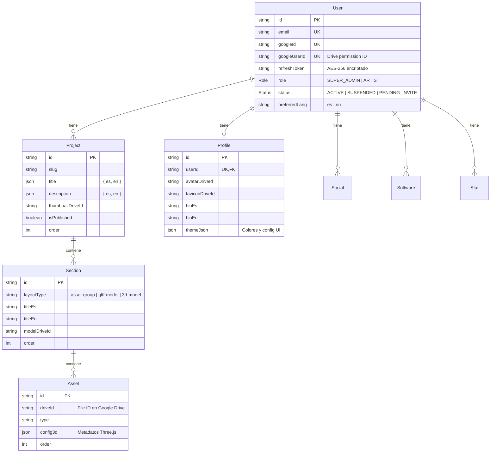

# Yezzfolio CMS

> **Tu portfolio de artista, sin tocar código.**  
> Gestioná tu contenido desde un panel visual y publicalo en la web con un solo clic.  
> Multi-artista · Bilingüe (ES/EN) · Google Drive como almacenamiento.

---

## ¿Qué problema resuelve?

Los artistas, diseñadores y creativos necesitan mostrar su trabajo online, pero montar y mantener un portfolio web requiere conocimientos técnicos (HTML, frameworks, hosting, SEO) que no son su oficio.

**Yezzfolio** separa la creación de contenido de la parte técnica:

| El artista... | Yezzfolio se encarga de... |
|---------------|---------------------------|
| Sube imágenes, modelos 3D, videos | Almacenarlos en Google Drive de forma privada |
| Organiza proyectos y secciones | Generar un JSON estructurado para el frontend |
| Edita su perfil, bio, redes | Servir los archivos de forma pública y cacheada |
| Hace clic en "Publicar" | Disparar el deploy automático del sitio |

El frontend (Astro SSG) consume esos JSON y renderiza el portfolio — **sin que el artista toque una línea de código**.

### ¿Para quién es?

- **Artistas individuales** que quieren su portfolio online sin depender de un dev
- **Agencias o colectivos** que gestionan múltiples portfolios bajo una misma plataforma
- **Desarrolladores** que necesitan un CMS headless para portfolios con soporte bilingüe y Google Drive

---

## Stack

| Capa | Tecnología |
|------|-----------|
| API Backend | Node.js · Express 5 · TypeScript |
| ORM / DB | Prisma 7 · PostgreSQL |
| Validación | Zod |
| Autenticación | JWT + Google OAuth 2.0 |
| Almacenamiento | Google Drive (API v3) |
| Admin UI | React 19 · Vite · Material UI 9 |
| i18n | Bilingüe ES/EN nativo (JSONB en DB) |
| Exportación | JSON estático compatible con Astro SSG |

---

## Arquitectura General

```
┌──────────────┐     ┌──────────────────┐     ┌─────────────────────┐
│  Admin UI    │────▶│  Yezzfolio API   │────▶│  Google Drive API    │
│  (React/MUI) │     │  (Express/TS)    │     │  (storage + proxy)   │
└──────────────┘     └────────┬─────────┘     └─────────────────────┘
                              │
                     ┌────────▼─────────┐     ┌─────────────────────┐
                     │   PostgreSQL     │     │  Portfolio Frontend  │
                     │   (Prisma ORM)   │────▶│  (Astro SSG)         │
                     └──────────────────┘     └─────────────────────┘
```

**Flujo de publicación:**

1. El artista edita proyectos, secciones y assets desde el Admin UI
2. Hace clic en **"Publicar"** → el backend consulta PostgreSQL y construye 4 archivos JSON (`works_es`, `works_en`, `profile_es`, `profile_en`)
3. Si hay un webhook configurado, se dispara el deploy del frontend Astro
4. El portfolio se regenera con los datos actualizados

**Flujo de archivos:**

1. El artista sube imágenes/modelos → se almacenan en su Google Drive privado
2. El portfolio los pide via `GET /api/drive/proxy/{driveId}`
3. El backend autentica contra Drive con el token del artista dueño del archivo
4. Se sirve el archivo con `Cache-Control: max-age=31536000` (1 año)

---

## Estructura del Proyecto

```
yezzfolio/
├── src/                        # Backend SaaS (Express + Prisma)
│   ├── app.ts                  # Configuración de Express, rutas, middlewares
│   ├── server.ts               # Entry point
│   ├── config/
│   │   └── env.ts              # Validación de variables de entorno (Zod)
│   ├── core/
│   │   ├── db.ts               # Prisma client singleton + pool PostgreSQL
│   │   ├── types/
│   │   │   └── global.d.ts     # Extensión de Express.Request (req.user)
│   │   ├── middlewares/
│   │   │   ├── auth.middleware.ts   # requireAuth, requireSuperAdmin
│   │   │   ├── validate.ts         # Middleware factory de validación Zod
│   │   │   └── errorHandler.ts     # Error handler global
│   │   └── utils/
│   │       ├── sanitize.ts     # Sanitización HTML (sanitize-html)
│   │       ├── encrypt.ts      # AES-256-CBC para refresh tokens
│   │       └── logger.ts       # Logger mínimo con timestamp
│   └── modules/
│       ├── auth/               # Login Google + OAuth Drive
│       ├── profile/            # Identidad, socials, software, stats
│       ├── projects/           # CRUD proyectos, secciones, assets
│       ├── drive/              # Proxy público + upload a Google Drive
│       ├── generator/          # Generación de JSON para SSG
│       └── users/              # Gestión de artistas (solo SUPER_ADMIN)
│
├── bridge/                     # Sistema legacy (SQLite) — en migración
│   ├── src/                    # Misma lógica que el SaaS pero con SQLite
│   └── admin-ui/               # Panel de administración (React + MUI)
│
├── prisma/
│   └── schema.prisma           # Modelo de datos (PostgreSQL)
│
├── .env.example                # Template de variables de entorno
├── package.json
└── nodemon.json
```

### Organización de cada módulo

Cada módulo sigue el mismo patrón:

```
modules/<nombre>/
├── <nombre>.routes.ts      # Definición de endpoints
├── <nombre>.controller.ts  # Thin wrapper — pasa req → service
├── <nombre>.service.ts     # Toda la lógica de negocio
└── <nombre>.schemas.ts     # Schemas de validación Zod (si aplica)
```

---

## Modelo de Datos



| Modelo | Propósito |
|--------|-----------|
| **User** | Whitelist de artistas. Se activan en su primer login con Google |
| **Profile** | Identidad del artista (bio, avatar, SEO, contacto, tema visual) |
| **Project** | Un proyecto del portfolio. Campos bilingües como JSONB |
| **Section** | Sección dentro de un proyecto. Layout type determina cómo se renderiza |
| **Asset** | Archivo multimedia (imagen, video, modelo 3D). Referencia a Google Drive |
| **Social / Software / Stat** | Listas del perfil: redes sociales, herramientas, estadísticas |

> **Nota sobre campos bilingües:** `title` y `description` en Project usan JSONB (`{ "es": "...", "en": "..." }`).  
> Section y Asset usan campos separados (`titleEs`, `titleEn`) para simplicidad de queries.

### Estados de usuario

| Status | Significado |
|--------|-------------|
| `PENDING_INVITE` | El admin invitó al artista pero aún no hizo login |
| `ACTIVE` | Login completado, puede usar el sistema |
| `SUSPENDED` | Cuenta suspendida, no puede autenticarse |

---

## Setup

### Prerrequisitos

- Node.js ≥ 18
- PostgreSQL ≥ 14
- Una cuenta de Google Cloud con OAuth 2.0 configurado
- (Opcional) Google Drive API habilitada

### Instalación

```bash
# Clonar el repo
git clone <repo-url>
cd yezzfolio

# Instalar dependencias
npm install

# Copiar y configurar variables de entorno
cp .env.example .env
```

### Configurar Google Cloud

1. Creá un proyecto en [Google Cloud Console](https://console.cloud.google.com)
2. Habilitá **Google Drive API** y **People API** (opcional, para avatar)
3. En **Credentials** → Crear OAuth 2.0 Client ID (tipo Web Application)
4. Configurá el redirect URI: `http://localhost:3000/api/auth/drive/callback`
5. Copiá `GOOGLE_CLIENT_ID` y `GOOGLE_CLIENT_SECRET` a tu `.env`

### Variables de entorno (`.env`)

| Variable | Requerida | Default | Descripción |
|----------|-----------|---------|-------------|
| `DATABASE_URL` | ✅ | — | PostgreSQL connection string |
| `JWT_SECRET` | ✅ | — | Clave para firmar JWT y encriptar refresh tokens |
| `GOOGLE_CLIENT_ID` | ✅ | — | OAuth 2.0 Client ID |
| `GOOGLE_CLIENT_SECRET` | ✅ | — | OAuth 2.0 Client Secret |
| `GOOGLE_REDIRECT_URI` | ✅ | — | URL de callback OAuth de Drive |
| `PORT` | ❌ | `3000` | Puerto del servidor |
| `PROXY_BASE_URL` | ❌ | — | URL pública del proxy (ej. `https://api.tudominio.com/api/drive/proxy`) |
| `ASTRO_WEBHOOK_URL` | ❌ | — | Deploy hook de Vercel/Netlify para el frontend |

### Iniciar en desarrollo

```bash
# Solo el backend
npm run dev

# Backend + Admin UI (en paralelo)
npm run dev:api    # puerto 3000
npm run dev:admin  # puerto 5173
```

### Setup de base de datos

```bash
# Generar el cliente Prisma
npx prisma generate

# Ejecutar migraciones
npx prisma migrate dev

# (Opcional) Sembrar un usuario SUPER_ADMIN inicial
npx tsx prisma/seed.ts
```

---

## Flujos Clave

### 1. Autenticación (Login con Google)

```
Admin UI                    Backend                    Google
   │                          │                          │
   │── Login con Google ──────│                          │
   │   (@react-oauth/google)  │                          │
   │                          │                          │
   │── POST /api/auth/google──▶                          │
   │   { idToken }            │── verifyIdToken() ──────▶│
   │                          │◀── payload (email, id) ──│
   │                          │                          │
   │                          │── Busca user por email   │
   │                          │   - PENDING_INVITE → activa
   │                          │   - SUSPENDED → rechaza  │
   │                          │   - No existe → rechaza  │
   │                          │                          │
   │◀── { token, user } ──────│── Genera JWT (exp: 7d)  │
   │                          │                          │
   │── Guarda token en localStorage                     │
   │── Todas las requests: Authorization: Bearer <jwt>  │
```

**Roles:**
- `ARTIST`: gestiona solo su propio contenido (multi-tenant isolation)
- `SUPER_ADMIN`: puede invitar/suspender artistas, ver stats globales

### 2. Conexión de Google Drive

Cada artista conecta su propio Google Drive para almacenar archivos:

1. `GET /api/auth/drive/connect` → genera URL de consentimiento OAuth (scope: `drive.readonly`)
2. El artista autoriza → Google redirige a `/api/auth/drive/callback?code=...&state=userId`
3. Backend intercambia `code` por tokens de acceso
4. El `refresh_token` se **encripta con AES-256-CBC** y se guarda en `User.refreshToken`
5. El `googleUserId` (permission ID) se guarda para verificaciones de ownership

> ⚠️ **Importante:** El refresh token de Google solo se entrega en el **primer consentimiento**. Si el artista ya autorizó antes, hay que revocar el acceso desde Google Account y volver a autorizar.

### 3. Proxy de Google Drive

**Problema:** los archivos están en Google Drive privado de cada artista, pero el portfolio público necesita mostrarlos.

**Solución:** proxy de streaming que resuelve automáticamente quién es dueño de cada archivo.

```
Portfolio Frontend                Backend                  Google Drive
      │                              │                          │
      │── GET /api/drive/proxy/{id}──▶                          │
      │                              │                          │
      │                              │── ¿Quién es dueño?      │
      │                              │   Busca driveId en:     │
      │                              │   Asset → Section →     │
      │                              │   Project → userId      │
      │                              │   Profile (avatar)      │
      │                              │                          │
      │                              │── getDriveClient(userId) │
      │                              │── drive.files.get() ────▶
      │                              │◀── stream ───────────── │
      │◀── stream + Cache-Control ───│                          │
```

**Headers de respuesta:**
- `Content-Type`: el MIME type original del archivo en Drive
- `Cache-Control: public, max-age=31536000` (1 año)
- `Access-Control-Allow-Origin: *`

### 4. Publicación / Exportación

```
Admin UI                     Backend                       SSG (Vercel/Netlify)
   │                            │                              │
   │── POST /api/generator/build▶                             │
   │   (Authorization: Bearer)  │                              │
   │                            │── buildFullPayload(userId)   │
   │                            │   ├── User + Profile         │
   │                            │   ├── Socials + Software     │
   │                            │   ├── Stats                  │
   │                            │   └── Projects + Sections    │
   │                            │       + Assets               │
   │                            │                              │
   │                            │── Genera 4 JSON:             │
   │                            │   works_es.json              │
   │                            │   works_en.json              │
   │                            │   profile_es.json            │
   │                            │   profile_en.json            │
   │                            │                              │
   │                            │── ¿ASTRO_WEBHOOK_URL?        │
   │                            │   Sí → POST payload ────────▶│
   │                            │                              │── Rebuild + deploy
   │                            │   No → devuelve preview      │
   │◀── { success, payload? } ──│                              │
```

**Transformaciones durante la exportación:**
- Todos los `driveId` se convierten en URLs: `{PROXY_BASE_URL}/{driveId}`
- `layoutType` de secciones se mapea a tipos del frontend: `asset-group`, `gltf-model`, `3d-model`
- Titles y descriptions se resuelven por idioma con fallback a español

---

## API Reference

### Auth `[POST]`

| Endpoint | Auth | Descripción |
|----------|------|-------------|
| `POST /api/auth/google` | No | Login con Google ID Token. Retorna JWT + datos de usuario |
| `GET /api/auth/drive/connect` | JWT | Genera URL de consentimiento OAuth para Google Drive |
| `GET /api/auth/drive/callback` | No | Callback OAuth — intercambia code por tokens |

### Profile `[GET, POST]`

| Endpoint | Auth | Descripción |
|----------|------|-------------|
| `GET /api/profile/full` | JWT | Perfil completo (identity + socials + software + stats) |
| `POST /api/profile/identity` | JWT | Crea/actualiza identidad y SEO del artista |
| `POST /api/profile/socials` | JWT | Reemplaza lista completa de redes sociales |
| `POST /api/profile/software` | JWT | Reemplaza lista completa de software/herramientas |
| `POST /api/profile/stats` | JWT | Reemplaza lista completa de estadísticas |

### Projects `[GET, POST, PUT, DELETE]`

| Endpoint | Auth | Descripción |
|----------|------|-------------|
| `GET /api/projects` | JWT | Lista todos los proyectos del usuario autenticado |
| `GET /api/projects/:slug` | JWT | Proyecto por slug con secciones y assets |
| `POST /api/projects` | JWT | Crea nuevo proyecto |
| `PUT /api/projects/:slug` | JWT | Actualiza proyecto (verifica ownership) |
| `DELETE /api/projects/:slug` | JWT | Elimina proyecto (cascade: sections + assets) |
| `POST /api/projects/:slug/sections` | JWT | Upsert de sección dentro del proyecto |
| `DELETE /api/projects/:slug/sections/:sectionId` | JWT | Elimina sección (cascade: assets) |
| `POST /api/projects/:slug/sections/:sectionId/assets` | JWT | Upsert de asset en la sección |

### Drive `[GET, POST]`

| Endpoint | Auth | Descripción |
|----------|------|-------------|
| `GET /api/drive/proxy/:driveId` | No | Proxy público — streamea archivo desde Google Drive |
| `GET /api/drive/check/:driveId` | JWT | Verifica que el usuario autenticado sea dueño del archivo |
| `POST /api/drive/upload` | JWT | Sube archivo a Google Drive del usuario. Retorna `driveId` |

### Generator `[POST]`

| Endpoint | Auth | Descripción |
|----------|------|-------------|
| `POST /api/generator/build` | JWT | Construye payload JSON. Si `ASTRO_WEBHOOK_URL` está configurado, dispara deploy |

### Users — Admin `[GET, POST]`

| Endpoint | Auth | Descripción |
|----------|------|-------------|
| `GET /api/admin/users` | JWT + SUPER_ADMIN | Lista todos los usuarios con conteo de proyectos |
| `GET /api/admin/users/stats` | JWT + SUPER_ADMIN | Stats globales: artists activos, pendientes, proyectos |
| `POST /api/admin/users/invite` | JWT + SUPER_ADMIN | Invita un nuevo artista (whitelist) |

---

## Admin UI

El panel de administración está en `admin-ui/`. Es una SPA React que se comunica con la API.

| Ruta | Acceso | Descripción |
|------|--------|-------------|
| `/login` | Público | Login con Google |
| `/dashboard` | ARTIST | Lista de proyectos, acceso rápido a publicar |
| `/project/:id` | ARTIST | Editor de proyecto: drag & drop de secciones y assets |
| `/profile` | ARTIST | Editor de identidad, bio, redes, software, stats |
| `/admin-dashboard` | SUPER_ADMIN | Stats globales, gestión de artistas |

**Tecnologías:** React 19, TypeScript, Material UI 9, React Router 7, `@dnd-kit` (drag & drop), i18next, Axios.

---

## Patrones y Convenciones

### Organización modular

Cada dominio está aislado en su propio módulo. No hay dependencias circulares entre módulos. Los servicios de un módulo solo son consumidos por el controller de ese mismo módulo.

### Controller-Service separation

Los controllers son thin wrappers — no contienen lógica de negocio:

```typescript
// Controller: solo extrae de req, llama al service, responde
async function getProjects(req: AuthRequest, res: Response) {
  const projects = await projectService.getUserProjects(req.user!.id);
  res.json({ success: true, data: projects });
}
```

### Multi-tenant isolation

**Cada operación verifica ownership:** ningún artista puede acceder a datos de otro.

```typescript
// El service siempre incluye userId en el where
async function updateProject(userId: string, slug: string, data: UpdateProjectDTO) {
  const result = await prisma.project.updateMany({
    where: { slug, userId },  // ← ownership check
    data,
  });
  if (result.count === 0) throw new AppError('NOT_FOUND_OR_UNAUTHORIZED', 404);
}
```

### Upsert en lugar de create-or-check

Para entidades que pueden existir o no (profile, sections), se usa upsert:

```typescript
await prisma.profile.upsert({
  where: { userId },
  update: data,
  create: { userId, ...data },
});
```

### Sanitización automática

Todo texto que entra a la base de datos pasa por `cleanObject()` que aplica `sanitize-html` (strip all HTML tags) recursivamente a todos los strings del payload.

---

## Seguridad

| Aspecto | Implementación |
|---------|---------------|
| **Autenticación** | JWT firmado con `JWT_SECRET`. Expira en 7 días. |
| **Autorización** | Middleware `requireAuth` + `requireSuperAdmin`. Ownership check en cada query. |
| **Refresh tokens** | Encriptados con AES-256-CBC (clave derivada de `JWT_SECRET`). |
| **Input validation** | Zod schemas en cada módulo. Middleware `validate` genérico. |
| **XSS** | Sanitización HTML en todos los textos. |
| **Proxy público** | Resolución automática de ownership. Sin credenciales expuestas. |
| **CORS** | Configurado via `cors()` middleware. |

> ⚠️ **Oportunidades de mejora:**
> - El proxy público no tiene rate limiting — considerar agregar para producción
> - `JWT_SECRET` se reutiliza como clave de encriptación — idealmente deberían ser claves separadas
> - Los refresh tokens de Google solo se entregan en el primer consentimiento — planificar UX para re-autorización

---

## Roadmap

| Prioridad | Tarea | Estado |
|-----------|-------|--------|
| 🔴 Alta | Migrar datos de SQLite (bridge) a PostgreSQL | Pendiente |
| 🔴 Alta | Actualizar Admin UI para usar nuevos endpoints | Pendiente |
| 🟡 Media | Rate limiting en proxy de Drive | Pendiente |
| 🟡 Media | Separar `JWT_SECRET` de encryption key | Pendiente |
| 🟢 Baja | Tests unitarios y de integración | Pendiente |
| 🟢 Baja | Gestión de planes/suscripciones por artista | Futuro |
| 🟢 Baja | Panel de métricas (vistas, popularidad) | Futuro |

---

## Proyectos Relacionados

- **[littlepigman-portafolio](https://github.com/JessZB/littlepigman-portafolio)** — Frontend Astro que consume los JSON generados por Yezzfolio
- **Google Cloud Console** — [Configuración OAuth 2.0](https://console.cloud.google.com/apis/credentials)

---

> Built with ❤️ by **JessZB**.  
> Si este proyecto te sirve, dejale una estrella ⭐ o contribuí con ideas, issues y PRs.
